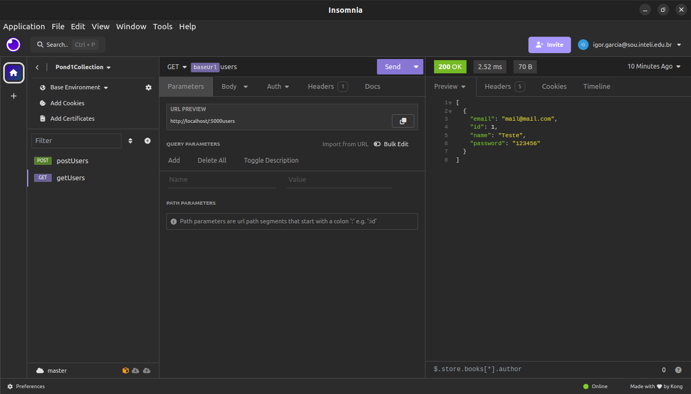

# Flask User Management API

Esta é uma API simples para gerenciamento de usuários desenvolvida usando Flask.

## Funcionalidades

- Registro de usuários
- Login de usuários
- CRUD (Criar, Ler, Atualizar, Deletar) usuários

## Requisitos

- Python
- Flask
- Flask-JWT-Extended
- Flask-SQLAlchemy

## Instalação e Execução

Siga as instruções para a instalação da API na sua máquina. Rode os seguintes comandos no diretório `Modulo10/pond1`

1. Instale as dependências:

   ```bash
   python3 -m pip install -r requirements.txt
   ```

2. Criação do Banco de Dados:

   ```bash
   python3 main.py create_db
   ```

3. Execução da API:
 
    ```bash
   python3 -m flask --app main run
    ```


A aplicação estará disponível em [http://localhost:5000](http://localhost:5000).

## Documentação da API

A documentação da API pode ser encontrada [aqui](./swagger.yaml). Esta documentação fornece informações detalhadas sobre todas as rotas disponíveis, os parâmetros necessários e exemplos de uso.

## Testes de Rotas

Você pode interagir com a API usando qualquer cliente HTTP ou ferramenta de desenvolvimento de API. Aqui está um exemplo usando o insomnia para obter todos os usuários:

