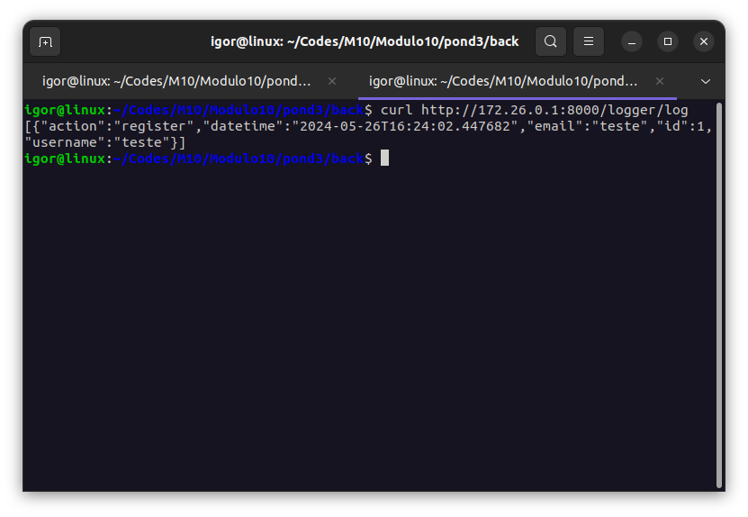

# ULTIMATE LOGGER API

Sistema de logs de sistemas baseado em produtos, usuários e ordens.

## Sistemas

### Sistema de Produtos e Usuários

O primeiro sistema gerencia produtos e usuários. Oferece funcionalidades de CRUD (Create, Read, Update, Delete) e utilizam FastAPI para a contrução da API e SQLAlchemy para interação com o banco de dados.

### Sistema de Pedidos (Ordens)

O segundo sistema gerencia pedidos, permitindo a criação, leitura, atualização e exclusão (CRUD) de ordens. Ele utiliza FastAPI para a construção da API e SQLAlchemy para interação com o banco de dados.

### Sistema de Logs

## Pré-requisitos

Antes de começar a usar esta aplicação, verifique se o seguinte software está instalado em seu sistema:

- Docker

## Configuração

Para ativar o sistema, rode o comando a seguir no diretório `Modulo10/pond4`:

```bash
sudo docker compose up
```

## Execução da Aplicação

Execute a aplicação no diretório `Modulo10/pond3/img_processor` com o comando:

```bash
flutter run
```

Isso iniciará a aplicação na sua máquina, dispositivo móvel ou emulador.

## IMG Processor APPI em Ação!

### Vídeo
Você pode conferir um vídeo do funcionamento do aplicativo clicando no link a seguir:

https://drive.google.com/file/d/15Qe4FKK5HWppMIRT0Ex_EZ8C4sQEgsCz/view?usp=sharing

### Log
Você pode conferir uma imagem do log de um login a seguir:


