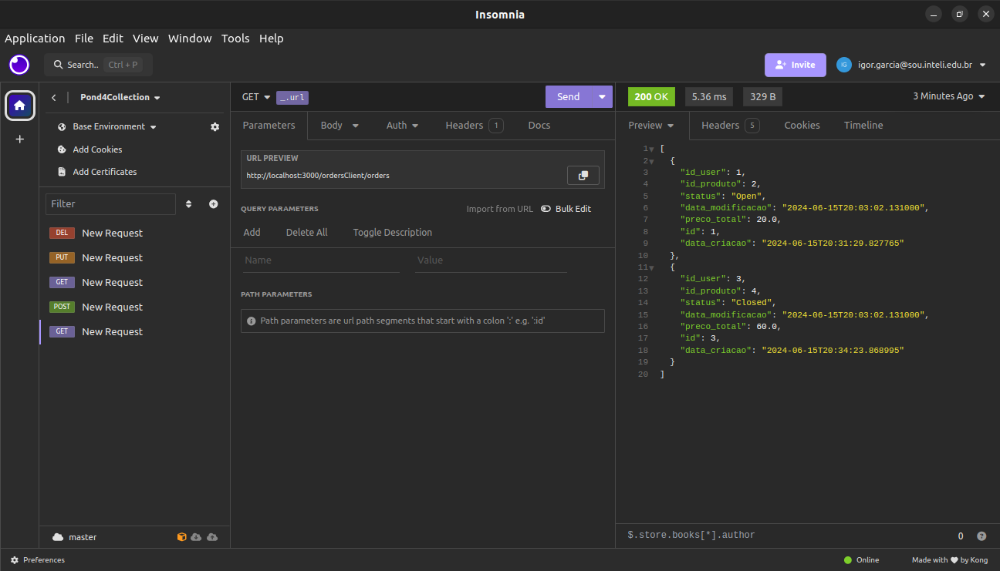

# ULTIMATE LOGGER API

Sistema de logs de sistemas baseado em produtos, usuários e ordens.

## Sistemas

### Sistema de Produtos e Usuários

O primeiro sistema gerencia produtos e usuários. Oferece funcionalidades de CRUD (Create, Read, Update, Delete) e utilizam FastAPI para a contrução da API e SQLAlchemy para interação com o banco de dados.

### Sistema de Pedidos (Ordens)

O segundo sistema gerencia pedidos, permitindo a criação, leitura, atualização e exclusão (CRUD) de ordens. Ele utiliza FastAPI para a construção da API e SQLAlchemy para interação com o banco de dados.

### Sistema de Gateway

O terceiro é um redirecionador para os sistemas descritos acima. Ele contém logs integrados ao filebeat, elasticsearch e kibana. Você pode visualizá-los no diretório `Modulo10/pond4/logs`.

## Pré-requisitos

Antes de executar o projeto, verifique se o seguinte software está instalado em seu sistema:

- Docker

## Execução do projeto

Para ativar o sistema, rode o comando a seguir no diretório `Modulo10/pond4`:

```bash
sudo docker compose up
```

## Testes de Rotas

Você pode interagir com a API usando qualquer cliente HTTP ou ferramenta de desenvolvimento de API. Aqui está um [exemplo](Insomnia.yaml) usando o insomnia para obter todos as ordens:




