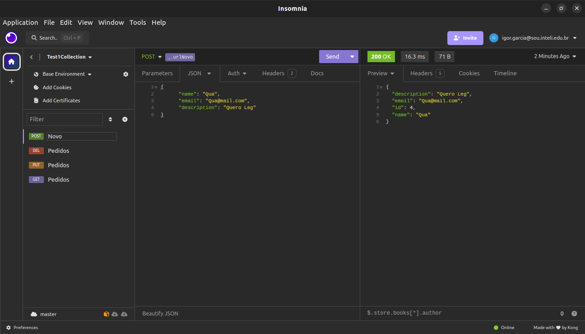
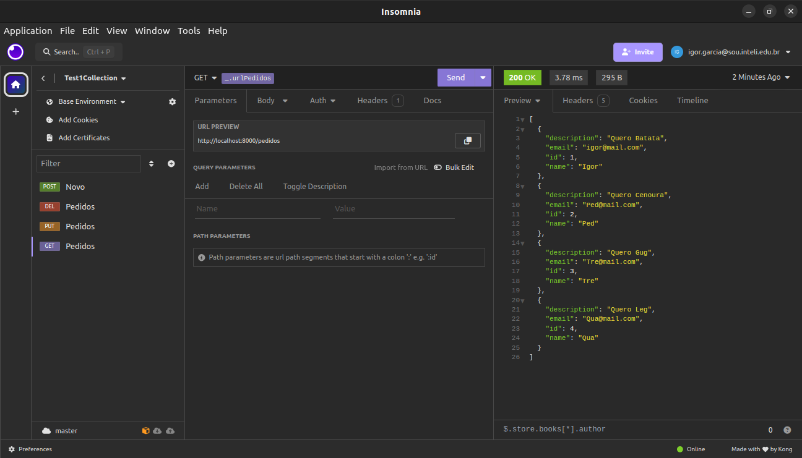
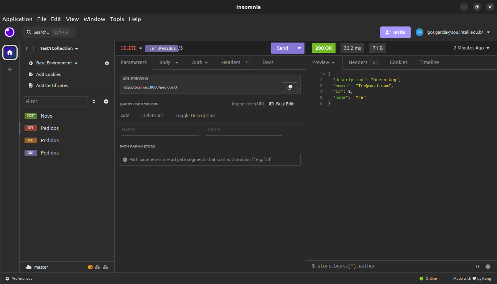
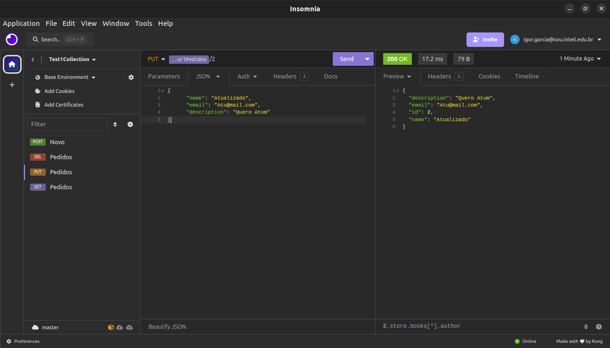
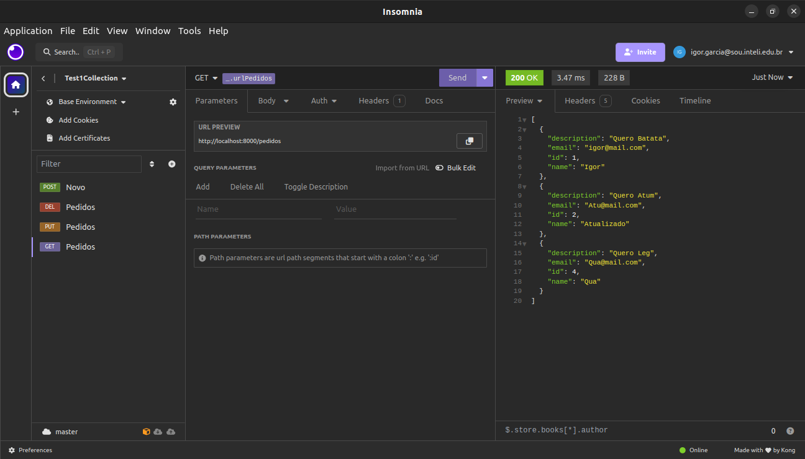

# Requests Management API

Esta é uma API simples para gerenciamento de pedidos desenvolvida usando Flask.

## Funcionalidades

- CRUD (Criar, Ler, Atualizar, Deletar) pedidos

## Requisitos

- Docker

## Execução utilizando Docker

Para executar a aplicação utilizando o Docker, rode os seguintes comandos no diretório `Modulo10/test1`:
   
   ```bash
   sudo docker build -t pedidos .
   ```

   ```bash
   sudo docker run -p 8000:80 pedidos
   ```

A API síncrona em flask estará disponível em http://localhost:8000

## Testes de Rotas

Você pode interagir com a API usando qualquer cliente HTTP ou ferramenta de desenvolvimento de API. Aqui está um [exemplo](Insomnia.yaml) usando o insomnia.









