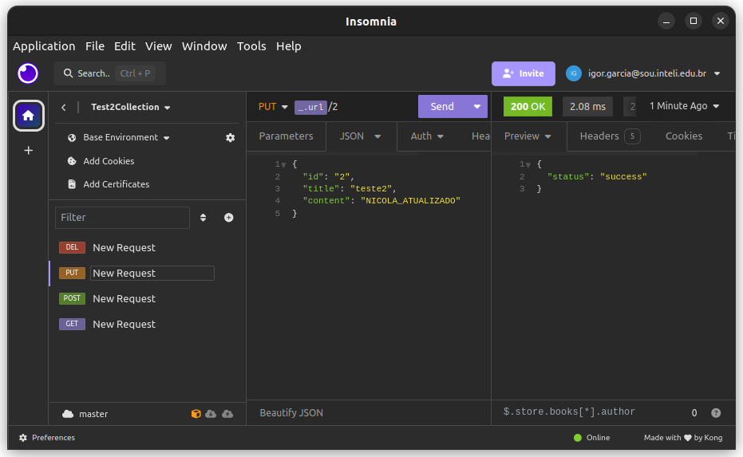
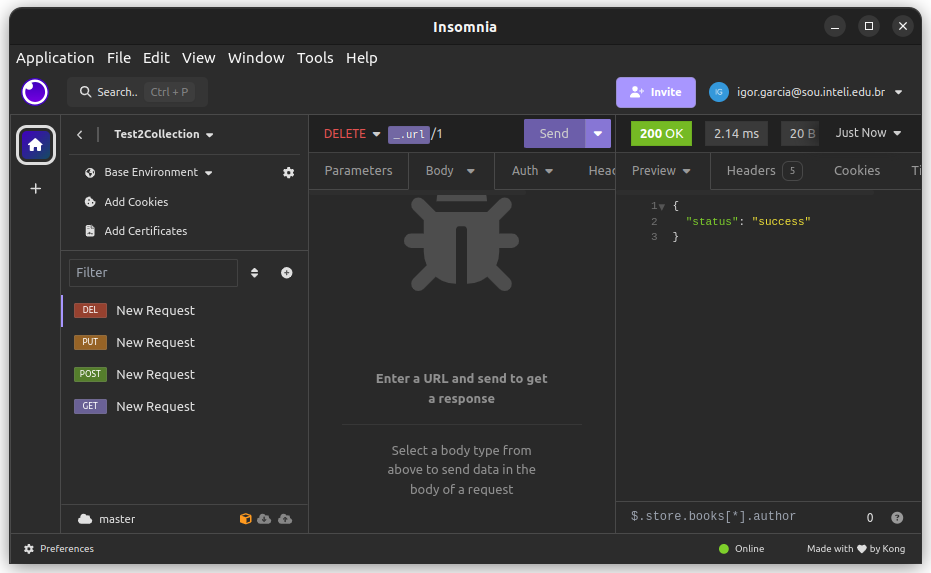
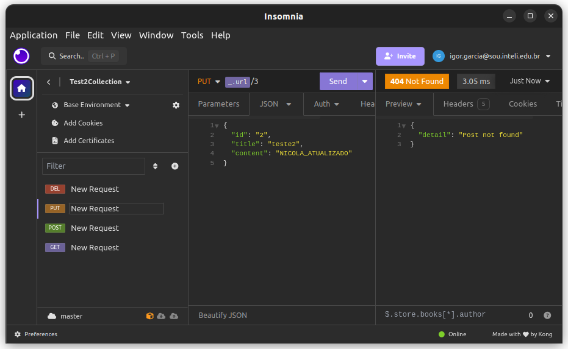

# Blogs API

Esta é uma API simples para gerenciamento de blogs usando FastAPI

## Requisitos

- Python
- Docker

## Instalação e Execução

Siga as instruções para a instalação da API usando uma máquina virtual. Rode os seguintes comandos no diretório `Modulo10/test2`

1. Crie o ambiente virtual com:

    ```bash
    python3 -m venv nome_do_ambiente
    ```

2. Ative o ambiente virtual com:

    ```bash
    source nome_do_ambiente/bin/activate
    ```

3. Instale as dependências no diretório `Modulo10/test2/app` com:

   ```bash
   python3 -m pip install -r requirements.txt
   ```

4. Execução da API:
 
   ```bash
   python3 fastapi run main.py --host 0.0.0.0 --port 8000
   ```

## Execução utilizando Docker

Para executar a aplicação utilizando o Docker, rode o seguinte comando no diretório `Modulo10/test2`:
   
   ```bash
   sudo docker compose up
   ```

## Testes da API

Você pode interagir com a API usando qualquer cliente HTTP ou ferramenta de desenvolvimento de API. Aqui está um [exemplo](Insomnia.yaml) usando o insomnia:







